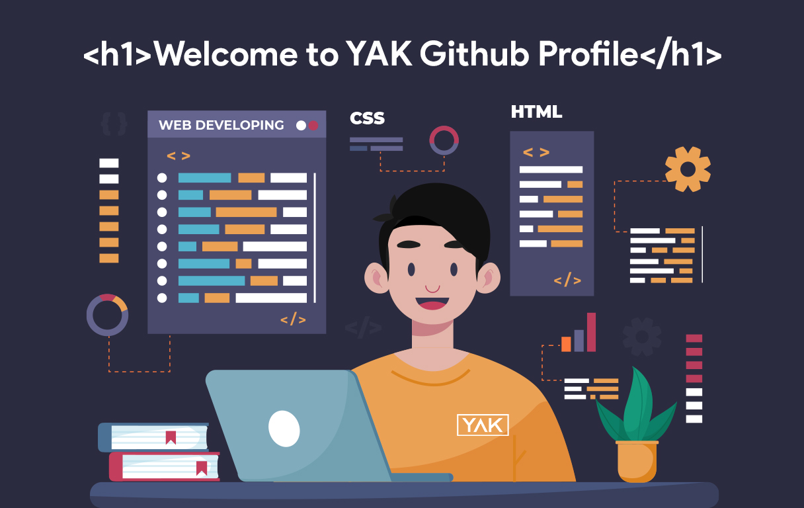

<p align="center">
  
</p>

<p align="center">
  <a href="https://scholar.google.com/citations?user=JejMIVwAAAAJ" title="Google Scholar" target="_blank">
    
  </a>
  <a href="https://twitter.com/yuris60" title="Instagram" target="_blank">
    
  </a>
  <a href="https://www.linkedin.com/in/yuris60" title="Linkedin" target="_blank">
    
  </a>
</p>

<p align="center" style="text-align: center; width:100%;">
  <h6>I CAN CODE</h6>
  <span></span>
  <span></span>
  <span></span>
  <span></span>
</p>

```js
const profile = {
    fullName: 'Yuris Alkhalifi',
    contact: 'yurisalkhalifi1@gmail.com',
    country: 'Indonesia',
    province: 'Jakarta',
    city: 'East Jakarta',
    work: 'as Lecturer',
    youtube: 'https://www.youtube.com/@YurisAlkhalifiYAK',
    googlescholar: 'https://scholar.google.com/citations?user=JejMIVwAAAAJ',
    sintakemdikbud: 'https://sinta.kemdikbud.go.id/authors/profile/6769136',
    orcid: 'https://orcid.org/0000-0001-8971-594X',
}
```

<!--
**yuris60/yuris60** is a ✨ _special_ ✨ repository because its `README.md` (this file) appears on your GitHub profile.

Here are some ideas to get you started:

- 🔭 I’m currently working on ...
- 🌱 I’m currently learning ...
- 👯 I’m looking to collaborate on ...
- 🤔 I’m looking for help with ...
- 💬 Ask me about ...
- 📫 How to reach me: ...
- 😄 Pronouns: ...
- ⚡ Fun fact: ...
-->
